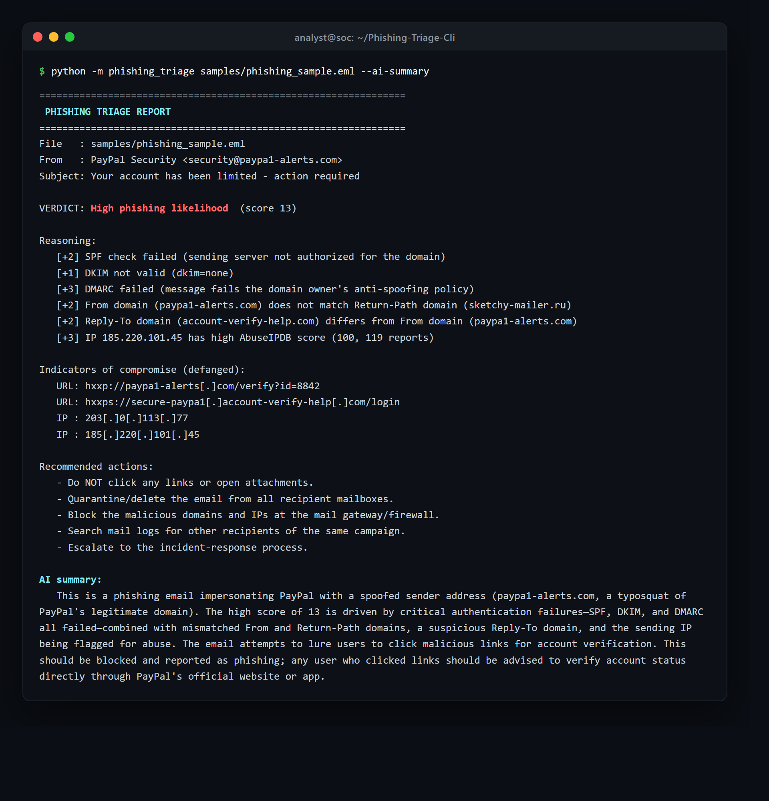
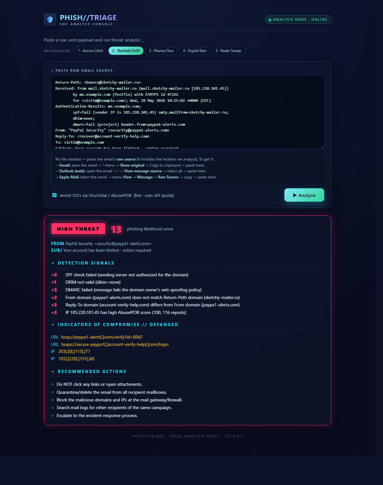

# Phishing Triage CLI

A command-line tool that automates the first-pass triage of a suspicious email. Point it at a
`.eml` file and it parses the message, extracts indicators of compromise (IOCs), checks those
indicators against threat-intelligence services, and produces a phishing-likelihood report with
reasoning and recommended SOC actions.

Built as a learning project to demonstrate practical SOC analyst workflows.

## What it does

1. **Parse** a `.eml` email file — sender, subject, key headers, and body.
2. **Extract IOCs** — URLs and IP addresses found in the headers and body.
3. **Enrich IOCs** — query the VirusTotal and AbuseIPDB APIs for reputation data.
4. **Report** — a triage summary: phishing-likelihood verdict, the reasoning behind it, and
   recommended analyst actions.

## Status

✅ Feature-complete. Milestones:

- [x] M0 — Project scaffolding & hygiene
- [x] M1 — Parse a `.eml` file
- [x] M2 — Extract IOCs (URLs + IPs)
- [x] M3 — Enrich IOCs via VirusTotal + AbuseIPDB
- [x] M4 — Triage report & scoring
- [x] M5 — Polish (CLI flags, tests, docs)
- [x] M6 — Optional web UI (Flask)
- [x] M7 — Optional AI summary (Claude API)

## Setup

```bash
# 1. Clone the repo, then create and activate a virtual environment
py -m venv .venv
.venv\Scripts\Activate.ps1        # Windows PowerShell

# 2. Install dependencies
pip install -r requirements.txt

# 3. Configure API keys
copy .env.example .env            # then edit .env and add your keys
```

API keys are read from a local `.env` file (git-ignored). Get free keys from
[VirusTotal](https://www.virustotal.com/) and [AbuseIPDB](https://www.abuseipdb.com/).

## Usage

```bash
# Full triage (parse, extract IOCs, enrich via APIs, score)
python -m phishing_triage samples/phishing_sample.eml

# Fast offline run — skip the API calls (no keys required)
python -m phishing_triage samples/phishing_sample.eml --no-enrich

# Machine-readable JSON output (for automation/piping)
python -m phishing_triage samples/phishing_sample.eml --json

# Add a plain-English AI summary (optional; needs ANTHROPIC_API_KEY)
python -m phishing_triage samples/phishing_sample.eml --ai-summary

# Help
python -m phishing_triage --help
```

### Example output



```
================================================================
 PHISHING TRIAGE REPORT
================================================================
File   : samples/phishing_sample.eml
From   : PayPal Security <security@paypa1-alerts.com>
Subject: Your account has been limited - action required

VERDICT: High phishing likelihood  (score 13)

Reasoning:
   [+2] SPF check failed (sending server not authorized for the domain)
   [+1] DKIM not valid (dkim=none)
   [+3] DMARC failed (message fails the domain owner's anti-spoofing policy)
   [+2] From domain (paypa1-alerts.com) does not match Return-Path domain (sketchy-mailer.ru)
   [+2] Reply-To domain (account-verify-help.com) differs from From domain (paypa1-alerts.com)
   [+3] IP 185.220.101.45 has high AbuseIPDB score (100, 116 reports)

Indicators of compromise (defanged):
   URL: hxxp://paypa1-alerts[.]com/verify?id=8842
   URL: hxxps://secure-paypa1[.]account-verify-help[.]com/login
   IP : 203[.]0[.]113[.]77
   IP : 185[.]220[.]101[.]45

Recommended actions:
   - Do NOT click any links or open attachments.
   - Quarantine/delete the email from all recipient mailboxes.
   - Block the malicious domains and IPs at the mail gateway/firewall.
   - Search mail logs for other recipients of the same campaign.
   - Escalate to the incident-response process.
```

## Web UI (optional)

A lightweight Flask front-end is included for a quick visual demo. It is a thin
layer over the **same engine** the CLI uses — it parses the pasted email and calls
the identical `build_report()` function, so there is no duplicated logic.

```bash
pip install flask          # only needed for the web UI
python app.py              # then open http://127.0.0.1:5000
```

Paste an email's **raw source** (e.g. Gmail → *Show original*) and click Analyze.
Visit `http://127.0.0.1:5000/?demo=1` to see the bundled sample report immediately.



> Note: this runs Flask's development server and is intended for **local demo use**,
> not production. The CLI is the primary interface.

## How scoring works

Each detector contributes weighted `(points, reason)` signals; the total maps to a verdict.
No single signal decides — the verdict is the **weight of evidence**, mirroring how an analyst
reasons. A *clean* reputation result never lowers the score, because a brand-new phishing URL
is simply uncatalogued ("zero-day"), not proven safe.

| Signal source | Examples |
|---|---|
| Email authentication | SPF / DKIM / DMARC failures |
| Domain alignment | `From` vs `Return-Path` vs `Reply-To` mismatches |
| IOC reputation | high AbuseIPDB score, VirusTotal-flagged URLs |

Verdict thresholds: **High** ≥ 6, **Medium** ≥ 3, else **Low**.

## AI summary (optional)

With `--ai-summary` (and an `ANTHROPIC_API_KEY`), the tool calls the Claude API to
turn the report into a 2–4 sentence plain-English summary for a ticket. The LLM
**augments, it does not decide** — the deterministic weighted score remains the
source of truth, so the verdict stays auditable. To limit prompt-injection risk, the
model is given the *structured findings* (not the raw email) and told to treat that
content as data, not instructions. Without a key, the tool runs exactly as before.

## Testing

```bash
python -m pytest
```

The suite runs fully offline — network calls are mocked, so no API keys are needed to test.

## Tech

Python 3.13 · stdlib `email` parser · `requests` · `python-dotenv` · `pytest` · `flask` (optional web UI) · `anthropic` (optional AI summary)

## License

Released under the [MIT License](LICENSE).
